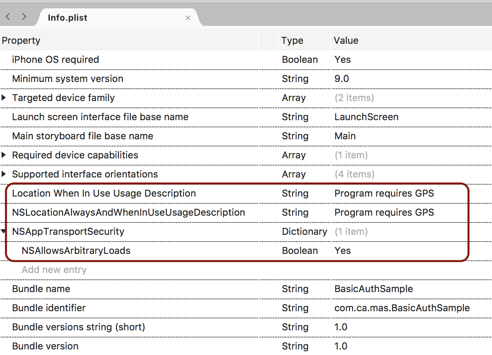
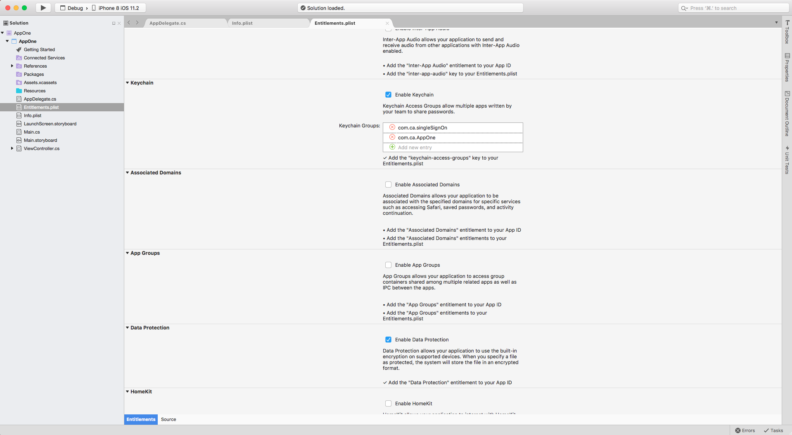

    
## iOS Guides MASFoundation for Xamarin

**MASFoundation** is the core MAS framework that handles the communication and authentication layer. Quickly build secure Xamarin apps using these built-in features:
 
- Authenticate with:
  - Device registration
  - User login and registered app
  - Fingerprint session lock
  - Single Sign-On
- Securely access protected APIs that are configured with OAuth 2.0

## Support and Prerequisites

- [Requirements for CA Mobile API Gateway](https://github.com/CAAPIM/Xamarin-MAS-Foundation/blob/DocEdits/Guides/COMMON_GUIDES.md)
- iOS 11.0 for new apps written in C# 
- Apple account ID  

## Create an App: Choose a Method

| Create your app using...                 | Benefits                                 |
| ---------------------------------------- | ---------------------------------------- |
| [Sample app](#quick-start-with-sample-app) | <ul><li>Use a sample app with features to securely log in, log out, and invoke a protected API on a CA Mobile API Gateway.<li>Ideal for exploring the methods, or building a real app.</li></ul> |
| [No sample app, from scratch](#create-app-from-scratch-or-integrate-an-existing-app-into-the-mobile-sdk) | <ul><li>Create a Xamarin app from scratch (or integrate an existing Xamarin app) for maximum project set up control. Just download the dynamic-link library (.dll) and add your app configuration file.</li></ul> |                                  

## Quick Start with Sample App

The iOS **BasicAuthSample** app:

- Lets you test the following with a CA Mobile API Gateway:    
  - Define authentication flow 
  - Start the SDK 
  - Log in
  - Access a protected API 
  - Log out
- Was created using Visual Studio Community 2017 build 7.3.3
- Requires iOS 8.0 or later to run the app

1. Open a terminal window in a directory of your choice and clone the MASFoundation repo: **git clone https://github.com/CAAPIM/Xamarin-MAS-Foundation.git**.  
After cloning, you will have /sample and /source directories for "Android" and "iOS".
2. In Visual Studio, select File, Open. 
3. Go to:`Xamarin-MAS-Foundation/sample/iOS/BasicAuthSample`, select **BasicAuthSample.csproj**, and click **Open**. 
4. Open the Assets folder and add your `msso_config.json` app configuration file.
5. Select **Build, Build All**, and verify "Build successful".
6. Deploy and install the application on an emulator.
7. In your emulator, launch the **BasicAuthSample** app.  
You should get the confirmation: **MAS SDK started successfully**.  
If you get an error, the most likely cause is an invalid app configuration file. See your Admin for help.
8. Now you can **log in**, **log out**, and **access a protected API**. 

[TBD - Will we improve sample or use slick demo by Microsoft consultant?]
[Sample app improvements: spelling errors Log in/Log out, human error messages, human text for grant flows, sample app should be something useful and interesting for enterprise.]

## Create App from Scratch or Integrate an Existing App into the Mobile SDK

If you have an existing Xamarin app that you want to integrate into the Mobile SDK, or simply want full control to set up a new app, these steps are for you.

::: alert info
**Note**: You cannot use an existing iOS Mobile SDK app. You must redo the app using c#.
::: 

### Step 1: Add Mobile SDK Libraries to Visual Studio

1. Verify that you have a CA Mobile API Gateway and an app configuration file (`msso_config.json`). 
2. Open a terminal window in a directory of your choice and copy and paste the following: **git clone https://github.com/CAAPIM/Xamarin-MAS-Foundation.git**     
Verify that you have both "Android" and "iOS" source directories. 
3. Open your app in Visual Studio.
4. Right-click the **References** folder and select **Edit References**. 
6. Select the **.Net Assembly** tab, and click the **Browse** button.
7. Go to: `Xamarin-MAS-Foundation/lib` directory, select the `MASFoundation.iOS.dll` file, click Open and then OK.

### Step 2: Update the Information Property List File

In Visual Studio, verify/change these settings:

**Update Info.plist**

1. Open the `Info.plist` file
2. At the bottom, click the Source tab. 
3. Add the following properties:  
    - **Location When In Use Usage Description** = "Program requires GPS"
    - **NSLocationAlwaysAndWhenInUseUsageDescription** = "Program requires GPS"
    - **NSAppTransportSecurity, NSAllowsArbitraryLoads** = "Yes"

::: Container width="300" align="left"

:::

### Step 3: Update System Settings

In Visual Studio, verify/change these settings:

**Update Entitlements.plist**

 1. Open the `Entitlements.plist` file.
 2. Verify/change these settings:  
     - **Keychain** = "Enable Keychain"
     - **Wallet**: deselect "Enable Wallet"
     - **Apple Pay**: deselect "Apple Pay"
     - **In-App Purchases**: deselect "In-App Purchases"

### Step 4: Configure Apple Developer Accounts (Apple ID)

In Visual Studio:

1. Go to: Preferences, Publishing, Apple Developer Accounts.
2. Add your Apple ID. 

### Step 5: Add the App Configuration File and Build 

1. Go to the folder containing your `msso_config.json` app configuration file, select it, and click **Copy the file to the directory**.  

::: alert danger
**Important**: The msso_config.json file must use a valid JSON format with the required data. If the file is not found, you'll get an error message and your app will not run. Do not change any of the contents without assistance from your Admin; if you remove or alter required values, your app may not be able to connect or interact with the MAG.
:::

::: alert note
**Note**: You can rename the msso_config.json configuration file. Just make sure that you use the .json extension, and you change the name before you start the library processes. 
:::

2. Select **Build/Rebuild All**.  
Verify that you get "Build successful" confirmation.

### Step 6: Start the SDK 

After your project is properly configured, you must start the SDK to establish a secure connection with the backend services. The method that starts the SDK is **MAS.start**. Note the following:

- You can put MAS.Start anywhere in your app
- MAS.Start should be processed before app startup (during the splash/loading screen of your app). 
- We recommended that you process any communication with the backend services after successful completion of the startup method, or the secure communication is not guaranteed and may fail.

### Start with standard method

This method starts the SDK with the currently-active configuration. A currently-active configuration is: 1) the last successfully used configuration, 2) the default JSON configuration file (i.e. msso_config.json in your app bundle) or 3) the custom JSON configuration file defined in `MAS.SetConfigurationFileName("YOUR_JSON.json");`.<br>
**Recommended for**: Most environments, including production.</br>

```
//
//  Initialize SDK with default or last active configuration
// 
MAS.Start(completion: (completed, error) => {
     
    if (error)
    {
        //  SDK initialized with an error
    } else {
        //  SDK initialized without an error
    }
});
 
```

###  Start with default configuration

This method starts the SDK with the currently-active configuration, or the default configuration (depending on the parameter). If you specify the YES parameter, this overwrites the currently-active configuration with the default configuration (if two configurations are different.). If you pass the NO parameter, this behaves the same as `MAS.Start();`. If the SDK is already started, this method: stops the SDK, then restarts it with the custom JSON object.<br>
**Recommended for**: Development environments where configurations change often.</br>

``` 
//
//  Initialize SDK always with default configuration
//
MAS.StartWithDefaultConfiguration(true, completion: (completed, error) => {
     
    if (error)
    {
        //  SDK initialized with an error
    } else {
        //  SDK initialized without an error
    }
});
```

#### Start with custom JSON

This method starts the SDK with the custom JSON object in jsonObject. This method overwrites the currently-active configuration with the custom JSON object, and stores it as the active configuration. If the SDK is already initialized, this method stops the SDK, then restarts it with the custom JSON object.
**Recommended for**: Using multiple MAG servers so that you can dynamically change the configuration during runtime. Note that the backend servers must have a version of the product that supports dynamic client configuration. 

```c#
//	Get NSDictionary of the configuration file
NSDictionary jsonConfiguration = ....;
MAS.StartWithJSON(jsonConfiguration, completion: (completed, error) => {
    if (error)
    {
        //  SDK initialized with an error
    } else {
        //  SDK initialized without an error
    }
});

```

#### Start with file URL

This method starts the SDK with the custom JSON configuration file. The custom file can be defined as a URL which indicates the path of the custom file. This method overwrites the currently-active configuration with the custom JSON file, and stores it as the active configuration. If the SDK is already initialized, this method stops the SDK, then restarts it with the custom JSON file. The SDK accepts the URL only with a __file__ protocol. If an internet URL is provided, the initialization method will fail.
**Recommended for**: Using multiple MAG servers that so you can dynamically change the configuration during runtime. Note: The backend servers must have a version of the product that supports dynamic client configuration. 

```c#
//	Get NSUrl of the configuration file
NSUrl configUrl = new NSUrl("msso_config.json", false);
MAS.StartWithURL(configUrl, completion: (startCompletedSuccessfully, error) => {
    if (error)
    {
        //  SDK initialized with an error
    } else {
        //  SDK initialized without an error
    }
});

```
 
#### Start with enrollment URL

This method dynamically initializes the SDK without having the the msso_config.json within the app bundle. This lets you dynamically update the msso_config.json file without having to reinstall the app when the file is updated. As a developer, you can easily switch between MAGs.

```c#
//	Get the enrollment URL
NSUrl enrollmentUrl = new NSUrl("https://YOUR_GATEWAY:8443/connect/device/config?sessionData=...&subjectKeyHash=...");
MAS.StartWithURL(enrollmentUrl, completion: (startCompletedSuccessfully, error) => {
    if (error)
    {
        //  SDK initialized with an error
    } else {
        //  SDK initialized without an error
    }
});
```

The Mobile SDK retrieves the `msso_config.json` configuration using an enrollment URL to a target MAG server. You can provide enrollment URL to the Mobile SDK through app linking with an application's custom URL scheme, or any other method. After the Mobile SDK retrieves the enrollment URL, it makes a request to the enrollment URL to download the msso_cconfig.json file, and then puts in the storage.

The enrollment URL is a customizable endpoint that contains the following data: publicKeyHash for SSL pinning (required by the Mobile SDK), and a signed JWT to secure session data. For example:

`https://YOUR_HOSTNAME:8443/connect/device/config?sessionData=eyJ0eXAiOiJKV1QiLCJhbGciOiJSUzI1NiJ9[…….]HMuAtMeG-MrA&subjectKeyHash=kqWXaaCtYDm2Xbmd0VdL-hDF8szTTuNRe6Dk_EY9-64%3D`

The enrollment URL can be in the following format:
  - `NSUrl`: the enrollment URL from the MAG server. SDK validates subjectKeyHash
  - `null`: SDK initializes with default or currently-active config

This initialization method overwrites the currently-active configuration with the configuration received using the enrollment URL, and stores it as the active configuration. If the SDK is already started, this method: stops the SDK, then restarts it with the configuration retrieved via the enrollment URL.

**About Implementation**

As stated, the enrollment URL must be generated from the MAG server and passed to Mobile SDK using a mutually-agreed upon process. The URL can be generated and passed in several ways, for example:

* A system administrator can request an enrollment URL from the MAG server and distribute it to the end user using SMS or email. The app can handle the enrollment URL through app linking with a custom URL scheme and the SDK is initialized.
* The application layer can handle the request for the enrollment URL from the MAG server. The app can perform user authentication without going through the SDK.

Whatever method you choose for the enrollment URL, customizations are required in the Mobile SDK and on the MAG server. Depending on your implementation and workflow, you may need to reauthenticate users multiple times to create a secure solution.

**To get started**:

- Talk with your Admin and determine 1) your enrollment URL process 2) the user authentication workflows.
- For the POST request (to request the enrollment URL), see the SDK Reference section.
- When implementing your app, use `MAS.MASState` to check the Mobile SDK status during the enrollment process to ensure success.
- For security reasons, the enrollment URL can only be used once (as expected for a one-time password). 

### Update Scopes for the Client App

When new scopes are added to the API, a new master client key must also be generated on the MAG. To update scopes for a client app:

Use the new msso_config.json by calling one of the following MAS.start interfaces (described in the previous section):
   - Start with default configuration (with true for shouldUseDefault)
   - Start with custom JSON
   - Start with file URL
   - Start with enrollment URL

### Keychain Synchronization

The Mobile SDK uses iOS Keychain Storage to secure credentials and sensitive data on mobile devices. When a mobile device is backed up to iCloud or transferred to another device, some of the data stored in keychain storage is also backed up or transferred to iCloud or another device.

By default, the Mobile SDK enforces all app credentials and data to **remain only on the device**; during backup, credentials are not synchronized to iCloud or transferred to another device. Use the following method to bypass the default and sync credentials and data to the iCloud.

Before initializing the Mobile SDK, configure the keychain synchronization option:

- `true`: Mobile SDK credentials in keychain storage are sync'ed with iCloud
- `false`: Mobile SDK credentials in keychain storage are NOT sync'ed with iCloud (default)

```c#
//
//	Enable keychain synchronization
//
MAS.SetKeychainSynchronizable(true);

//
//	Disable keychain synchronization (default)
//
```

## Login: User Authentication and Authorization

**Library**: MASFoundation<br>
**Description**: Authentication methods to use with the MAG and backend services.</br>

### No user authentication (default SDK flow)

**What**: No user authentication, just access an API. <br>
**Scenario**: Upon opening your mobile bank app, you want to show your users a few bank services. Because there is no sensitive data, user login is not required. Under the covers, the Mobile SDK requests access to the API using client ID and client secret for the registered app. If the app credentials are valid, the MAG returns an access token. In OAuth, this flow is called **client credential** and it is the default flow of the Mobile SDK. In a nutshell, client credentials authenticates access to an API.</br>

Set the `MAS.GrantFlow` propery to `MASGrantFlow.ClientCredentials` to set the default flow to no user authentication.

```c#
//  Set grantFlow to Client Credentials
MAS.GrantFlow = MASGrantFlow.ClientCredentials;

```

### Authenticate user with password, change default

**What**: Always start with login screen.<br>
**Scenario**: You created a mobile bank app that checks bank account balances. In this case, you want users to always log in because the data is sensitive. Under the covers, the Mobile SDK requests an access token from the MAG. If the username and password are valid, the MAG authenticates and grants access.</br>

Set the `MAS.GrantFlow` propery to `MASGrantFlow.Password` to  change the default flow to user authentication with password.

```c#
//  Set grantFlow to Password
MAS.GrantFlow = MASGrantFlow.Password;
```

### Authenticate user with password method

```c#
//
//  Log in with username and password
//
MASUser.LoginWithUserName("USER_NAME", "USER_PASSWORD", completion: (completed, error) => {
     
    if (error != null)
    {
        Console.WriteLine("Error: {0}", error.LocalizedDescription);
    } else {
        Console.WriteLine("Success: User login");
    }
});
```


### Authenticate user with password, event-based

**What**: Event-based user authentication<br>
**Scenario**: You are designing a chat app with single sign-on. If a user has not signed into the app for days (or other rules-based logic), you want your app to ensure that a login screen is redisplayed. The following method is a listener that sits on the MAG. When tokens have expired for the API, the MAG returns an error, triggering the SDK to display the login screen for user reauthentication.</br>

```c#
//
//  MAS.GrantFlow must be set to MASGrantFlow.Password in order to trigger implicit login flow
//  MAS.SetUserAuthCredentials block must be set before invoking an API
// 
MAS.SetUserAuthCredentials( (authCredentialsBlock) => {
 
    //  Build MASAuthCredentialsPassword with username and password
    MASAuthCredentialsPassword passwordCredentials = MASAuthCredentialsPassword.InitWithUsername("USER_NAME", "USER_PASSWORD");
 
    //  Invoke callback block, authCredentialsBlock, with MASAuthCredentialsPassword object
    authCredentialsBlock(passwordCredentials, false, (bool completed, NSError error) =>
    {
        if (error != null)
        {
            Console.WriteLine("Error {0}", error.LocalizedDescription);
        }
        else
        {
            Console.WriteLine("Success: User login");
        }
    });
});
```

#### Get current authenticated user

This method gets all of the properties of the currently authenticaticated user.

```c#
//
// Returns the currently authenticated user or null if there is no authenticated user.
//
MASUser currentUser = MASUser.CurrentUser;
```

#### Log out authenticated user

```c#
//
//  Logout currently authenticated user
//
MASUser.CurrentUser.LogoutWithCompletion(completion: (completed, error) => {
     
    if (error != null)
    {
        Console.WriteLine("Error: {0}", error.LocalizedDescription);
    } else {
        Console.WriteLine("Success: User logout");
    }
});
```


### Fingerprint Sessions Lock

**Library**: MASFoundation<br>
**Scenario**: You are creating an app that requires fingerprint recognition, or you just want to provide it as an alternative login method to a PIN and password.<br>
**Description**: The Mobile SDK supports fingerprint authentication only on the local device. That is, the user's fingerprint is compared against the image that is stored in the secure area on the chipset. If the unique characteristics of the fingerprints match, the user is authenticated, and the phone is unlocked.</br> 

The Mobile SDK supports using fingerprint session lock with device screen lock with passcode. Because the app user can use one, both, or no locking method at all, you need to handle all of these scenarios. If the device is configured without any lock method, the Mobile SDK returns an error that device lock security is missing.

::: alert info
**Note**: Multiple fingerprints can be stored on the device, including the user and people who the user trusts. If you store multiple fingerprints on the device, all users can access the app and any API call. If you implement fingerprint with Single Sign-On enabled, all apps using SSO require a fingerprint match to unlock.
:::

::: alert info
**Note**: Fingerprint session lock is locking the currently authenticated session by using `id_token` granted through user authentication. If Mobile SDK, or server side does not return the `id_token` on successful authentication, Mobile SDK will not be able to lock the session.
:::

::: alert danger 
**Important!** Currently, the Mobile SDK does not support fingerprint using multi-factor authentication, which is often mandated in government and enterprises (FIDO protocol). Specifically, the Mobile SDK does not match the device's fingerprint against an image that is stored on a secure server, and where the original fingerprint was scanned using a third-party fingerprint scanner. If you use the local device authentication using fingerprints, understand the inherent security limitations for this feature that are documented by your device vendor.
:::

**Supported**: iOS 9+ device enable with fingerprint and/or passcode

#### Lock user session

```c#
//
//	Lock the currently authenticated user with fingerprint local authentication.
//	This will prevent Mobile SDK to consume API, and will return an error saying
//	"User session is currently locked" on the response of API request.
//
//	If the local authentication is not registered and/or available, Mobile SDK will return an error
//
MASUser.CurrentUser.LockSessionWithCompletion(completion: (completed, error) => {
    
    if (completed)
    {
    	//	session lock successful
    }
    else {
    	// an error occurred while locking the session
    }
});
```

#### Verify locked user session

```c#
if (MASUser.CurrentUser.IsSessionLocked)
{
	//	currently authenticated user's session is locked
}
else if (MASUser.CurrentUser.IsAuthenticated) {
	// currently authenticated user's session is not locked
}
```

#### Unlock user session

```c#
//
//	Unlock the currently locked user session.
//
MASUser.CurrentUser.UnlockSessionWithCompletion(completion: (completed, error) => {
    
    if (completed)
    {
    	//	session unlock successful
    }
    else {
    	// an error occurred while unlocking the session
    }
}); 


//
//	Unlock the currently locked user session with customizable description text which will appear on device's local authentication screen.
//
MASUser.CurrentUser.UnlockSessionWithUserOperationPromptMessage("DESCRIPTION TEXT", completion: (completed, error) => { 
     ....       
});
```

#### Remove user session lock

```
//
//	Removes currently locked user's session, and also removes all credentials.
//	It will work like logging out the user locally.
//
MASUser.CurrentUser.RemoveSessionLock();
```

### Single Sign-On (SSO)

**Library**: MASFoundation<br>
**Scenario**: You are developing two bank apps that you want to work seamlessly together. You want to share credentials between the apps to reduce the number of times the user has to log in.<br> 
**Description:** Single Sign-On is a session and user authentication process that allows a user to enter a single username and password to access multiple apps. 

The Mobile SDK uses the following standards for a secure an SSO implementation:
- An OAuth access token is granted for each application
- An OpenID Connect user token is granted for user verification of the SSO session
- PKI provisioning for certificate‐based validation of device

There are no SDK methods. Simply get your Admin to configure the MAG for Single Sign-On, and enable the feature in your app using the following steps. The mobile apps must be using the same MAG.</br>  

1. In Visual Studio, enable your app by selecting the main project, the `Entitlements.plist`, check the Enable Keychain checkbox under Keychain section. 
2. Add two groups:
- One for your app in the first slot
- A shared keychain group identifier to enable single sign-on

::: alert info
**Note:** The prefix of the group identifier must match the prefix of the bundle identifier of the app. Also, all apps that share the keychain must have their bundle identifiers match this prefix. The suffix should be 'singleSignOn'
:::

The shared keychain group identifier that you specify in both apps must be the same and use the same prefix as the participating apps, for example: `com.ca.singleSignOn`. The following screenshot shows an example in one of the apps:

::: Container width="300" align="left"

:::

That's it! The MASFoundation library detects your shared keychain group settings (if set) and responds accordingly. 

## Access APIs

This section provides methods to call APIs. 

### Sent HTTP Requests to APIs

If you have custom endpoints installed on the MAG, you can make direct and secure HTTPS calls to them using the following methods. 

#### Build request with MASRequestBuilder

The MASRequestBuilder constructs the MASRequest object with options that can be modified for the request. This lets you customize and programmatically build a request and call the MAS.invoke method after MASRequest is built.

```c#
//  Create MASRequestBuilder with HTTP method 
MASRequestBuilder requestBuilder = new MASRequestBuilder("GET");

//
//  Specify an endpoint path, any parameters or headers, and request/response type
//
requestBuilder.EndPoint = "/protected/resource/products";
requestBuilder.Query = new NSDictionary("operation", "listProducts");
requestBuilder.RequestType = MASRequestResponseType.WwwFormUrlEncoded;
requestBuilder.ResponseType = MASRequestResponseType.Json;
 
//  Build MASRequestBuilder to convert into MASRequest object
MASRequest request = requestBuilder.Build();
 
//  Using MASRequest object, invoke API
MAS.Invoke(request, completion: (response, responseObject, error) => {
    if (error != null)
    {
        //  If an error was returned
        Console.WriteLine("Error: {0}", error.LocalizedDescription);
    }
    else 
    {
        //  If a response is returned
        string value = responseObject == null ? "No value" : responseObject.ToString();
        Console.WriteLine("Success: {0}", value);
    }
});
```

#### MASRequest methods

MASRequest also provides static methods to construct the request directly with MASRequestBuilder in the parameter of the block.

##### Get method

This method makes HTTP GET calls to an endpoint. Parameters are encoded into the endpoint URL as query parameters.

```c#
//
//	Construct MASRequest with static method
//
MASRequest request = MASRequest.GetFrom((requestBuilder) => {
	//
	//	Define request builder's properties within block
	//
   requestBuilder.EndPoint = "/protected/resource/products";
   requestBuilder.Query = new NSDictionary("operation", "listProducts");
   requestBuilder.RequestType = MASRequestResponseType.WwwFormUrlEncoded;
   requestBuilder.ResponseType = MASRequestResponseType.Json;
});

//
//	Use the request object to invoke an API
//
MAS.Invoke(request, completion: (response, responseObject, error) => {});
```

##### Delete method

This method makes HTTP DELETE calls to an endpoint. Parameters are encoded into the endpoint URL as query parameters.

```c#
//
//	Construct MASRequest with static method
//
MASRequest request = MASRequest.DeleteFrom((requestBuilder) => {
	//
	//	Define request builder's properties within block
	//
   requestBuilder.EndPoint = "/protected/resource/products";
   requestBuilder.Query = new NSDictionary("operation", "listProducts");
   requestBuilder.RequestType = MASRequestResponseType.WwwFormUrlEncoded;
   requestBuilder.ResponseType = MASRequestResponseType.Json;
});

//
//	Use the request object to invoke an API
//
MAS.Invoke(request, completion: (response, responseObject, error) => {});
```

##### Post method

This method makes HTTP POST calls to an endpoint. Parameters are encoded into the HTTP body.

```c#
//
//	Construct MASRequest with static method
//
MASRequest request = MASRequest.PostTo((requestBuilder) => {
	//
	//	Define request builder's properties within block
	//
   requestBuilder.EndPoint = "/protected/resource/products";
   requestBuilder.Body = new NSDictionary("operation", "listProducts");
   requestBuilder.RequestType = MASRequestResponseType.Json;
   requestBuilder.ResponseType = MASRequestResponseType.Json;
});

//
//	Use the request object to invoke an API
//
MAS.Invoke(request, completion: (response, responseObject, error) => {});
```

##### Put method

This method makes HTTP PUT calls to an endpoint. Parameters are encoded into the HTTP body.

```c#
//
//	Construct MASRequest with static method
//
MASRequest request = MASRequest.PutTo((requestBuilder) => {
	//
	//	Define request builder's properties within block
	//
   requestBuilder.EndPoint = "/protected/resource/products";
   requestBuilder.Body = new NSDictionary("operation", "listProducts");
   requestBuilder.RequestType = MASRequestResponseType.Json;
   requestBuilder.ResponseType = MASRequestResponseType.Json;
});

//
//	Use the request object to invoke an API
//
MAS.Invoke(request, completion: (response, responseObject, error) => {});
```

#### Simplified request methods

The Mobile SDK also provides static methods to construct and send request directly without using the `MASRequest` object.

All GET, DELETE, POST, and PUT MAS static methods also have the following set of parameters.

```c#
//
//	Default request, and response type are JSON in this method signature
//
(string endPointPath, NSDictionary parameterInfo, NSDictionary headerInfo, MASResponseInfoErrorBlock completion);

//
//	Default value for isPublic parameter is false in this method signature 
//
(string endPointPath, NSDictionary parameterInfo, NSDictionary headerInfo, MASRequestResponseType requestType, MASRequestResponseType responseType, MASResponseInfoErrorBlock completion);

(string endPointPath, NSDictionary parameterInfo, NSDictionary headerInfo, MASRequestResponseType requestType, MASRequestResponseType responseType, bool isPublic, MASResponseInfoErrorBlock completion);
```

##### Get method

```c#
NSMutableDictionary<NSString, NSString> param = new NSMutableDictionary<NSString, NSString>();
param.Add(new NSString("operation"), new NSString("listProducts"));

MAS.GetFrom(@"/protected/resource/products", param, null, MASRequestResponseType.WwwFormUrlEncoded, MASRequestResponseType.Json, completion: (responseInfo, error) =>
{
	//
	//	Handle response here
	//
});
```

##### Delete method

```c#
NSMutableDictionary<NSString, NSString> param = new NSMutableDictionary<NSString, NSString>();
param.Add(new NSString("operation"), new NSString("listProducts"));

MAS.DeleteFrom(@"/protected/resource/products", param, null, MASRequestResponseType.WwwFormUrlEncoded, MASRequestResponseType.Json, completion: (responseInfo, error) =>
{
	//
	//	Handle response here
	//
});
```

##### Post method

```c#
NSMutableDictionary<NSString, NSString> param = new NSMutableDictionary<NSString, NSString>();
param.Add(new NSString("operation"), new NSString("listProducts"));

MAS.PostTo(@"/protected/resource/products", param, null, MASRequestResponseType.Json, MASRequestResponseType.Json, completion: (responseInfo, error) =>
{
	//
	//	Handle response here
	//
});
```

##### Put method

```c#
NSMutableDictionary<NSString, NSString> param = new NSMutableDictionary<NSString, NSString>();
param.Add(new NSString("operation"), new NSString("listProducts"));

MAS.PutTo(@"/protected/resource/products", param, null, MASRequestResponseType.Json, MASRequestResponseType.Json, completion: (responseInfo, error) =>
{
	//
	//	Handle response here
	//
});
```

### Geolocation

**Library**: None

**Description**: Access to protected APIs can be based on the physical location of the application user. The application passes the physical location information to the MAG in the http header of an access request. Within the http header, location is expressed using latitude/longitude coordinates of the host device. SDK will prompt users to consent to access location information at runtime. Includes the location information in all requests when enabled. 

**To enable**: Add NSLocationAlwaysUsage Description (location service always in use), or NSLocationWheinUseUsageDescription (location service on demand) to the info.plist.  

**Dependencies**: Admin must enable geolocation in the policy. In the msso_config.json file, the Admin must set `mag.mobile_sdk.location_enabled` to `true` to enable it from the SDK.  If the value is set to `false`, the SDK does not ask for location permission, and does not include geolocation information in header. 


## Debug the SDK

### Configure app for network monitoring 

MAS always monitors the network reachability status of the MAG URL. If your app needs monitoring, here's how to hook your app into monitoring.

```c#
public class AppDelegate : UIApplicationDelegate
{
	public override bool FinishedLaunching(UIApplication application, NSDictionary launchOptions)
	{
		//
		// You can set the MAG monitor block like this.  It is recommended 
		// to set this before starting MAS
		//
		MAS.SetGatewayMonitor((MASGatewayMonitoringStatus status) => {
			... do something ...
		});
		
		//
		// Start MAS
		//
		MAS.Start(completion: (completed, error) => {
		    ... 
		});

		return true;
	}

}    

```

#### Configure status notifications

You can register the MAG to monitor status update notifications.  The notification is defined in MASConstants as shown below:

```c#
MASGatewayMonitorStatusUpdateNotification
```

#### Conveniences

To determine if the network connection to the MAG is currently reachable:

```c#
MAS.GatewayIsReachable;
```

To determine the current status as a string at any time:

```c#
MAS.GatewayMonitoringStatusAsString;
```


#### Stop and reset the device

To stop all processes in the library, use the following method:

```c#
void MAS.Stop(MASCompletionErrorBlock completion);
```

#### Reset all app, device, and user credentials

To reset all app, device, and user credentials in memory, or in the local and shared group keychains, use the following method:  

```c#
void MASDevice.ResetLocally();
```

::: alert info
**Note:** We recommend that you add a warning UI component or similar to indicate to the user exactly what they are doing, with a confirmation before proceeding with this action.
:::

::: alert info
**Note:** This only resets the credentials on the device. To reset and deregister the device record on the MAG, call MASDevice.CurrentDevice().DeregisterWithCompletion(MASCompletionErrorBlock completion).
:::

::: alert info
**Note:** You must restart your app to get new registration of the app, device and user authentication.
:::

#### Deregister a device

You can programmatically deregister a device to:

- Revoke access to a device identified as risky
- Use the device again for test runs
- Troubleshoot an app if there is a "device already registered" error

Deregistration removes the device record from MAG. Use this feature with caution because it may not be easy for end users to use if you make it publicly available.  We suggest a warning UI component or similar to indicate to the user exactly what they are doing, with a confirmation before proceeding with this action.

```c#
MASDevice.CurrentDevice().DeregisterWithCompletion(completion: (completed, error) => {
	... 
});
```

:::alert info
**Note**: You must restart your app to get new registration of the app, device and user authentication.
:::

To listen for the following notifications:

```c#
MASDeviceWillDeregisterNotification
MASDeviceDidFailToDeregisterNotification
MASDeviceDidDeregisterNotification
```

#### Notifications

During SDK startup, if the SDK detects the server switch from an old configuration to a new configuration, `MASWillSwitchGatewayServerNotification` and `MASDidSwitchGatewayServerNotification` are sent. You can optionally observe these notifications to handle any necessary operation that you may wish to do within your app.  

The SDK determines the server switch by these configuration values: **hostname, port, and prefix**.

#### Handle errors

All errors that occur during SDK startup are returned in the completion block of the method. 

```c#
//Initializing the SDK
MAS.Start(completion: (completed, error) => {    
	if (error)
	{
		//  Handle error here
		if(error.Domain.Equals(MASFoundationErrorDomain))
		{
			//  MASFoundation error domain
		}
		else if(error.Domain.Equals(MASFoundationErrorDomainLocal))
		{
			//  MASFoundation local error domain
		}
});
```

All errors that are returned from the startup process should contain proper error message descriptions in `error.localizedDescription` and `error.userInfo`.

##### MASFoundationErrorDomain

```c#
NSString MASFoundationErrorDomain = "com.ca.MASFoundation.Error:ErrorDomain";
```
This error is returned when the SDK fails during communications: app registration, device registration, or user authentication with backend services. This can be caused by invalid configuration values, or  misconfiguration on the backend services. 

The error should contain: 1) explanation of the error, 2) the backend services' specific error code and error response in `error.userInfo`.

##### MASFoundationErrorDomainLocal

```c#
NSString MASFoundationErrorDomainLocal = "com.ca.MASFoundation.localError:ErrorDomain";
```
This error is returned when the SDK fails because of client SDK configuration issues. The most common issues are: invalid JSON configuration file, misconfigured device settings (i.e. geolocation or other permissions), or network issues.

##### MASFoundationErrorDomainTargetAPI

```c#
NSString MASFoundationErrorDomainTargetAPI = "com.ca.MASFoundation.targetAPI:ErrorDomain";
```
This error is returned only when a custom endpoint on a backend service fails.

#### Get notifications

You can get notifications of the app registration, device registration and user authentication. These notifications are defined in MASConstants as shown below:

```c#
// SDK initialization lifecycle notifications
MASWillStartNotification
MASDidFailToStartNotification
MASDidStartNotification
MASWillStopNotification
MASDidFailToStopNotification
MASDidStopNotification

// SDK initialization server switch notifications
MASWillSwitchGatewayServerNotification
MASDidSwitchGatewayServerNotification

// Device de-registration notifications
MASDeviceWillDeregisterNotification
MASDeviceDidFailToDeregisterNotification
MASDeviceDidDeregisterNotification

// User authentication notifications
MASUserWillAuthenticateNotification
MASUserDidFailToAuthenticateNotification
MASUserDidAuthenticateNotification
MASUserWillLogoutNotification
MASUserDidFailToLogoutNotification
MASUserDidLogoutNotification
MASUserWillUpdateInformationNotification
MASUserDidFailToUpdateInformationNotification
MASUserDidUpdateInformationNotification
```

## Troubleshoot Your App

### Issues Between Your App and the MAG Server

This section describes some of the issues that arise between your app and the MAG server.

#### msso_config.json file 

The msso_config.json file is how the Mobile SDK communicates with the MAG server. It contains OAuth scope values that provide permissions to operations and access to resources for your app. If the file has missing or incorrect scopes, this can cause errors. 

**Scope help for Admins:**

- [Create a Client App for the Mobile SDK](https://docops.ca.com/mag)
- [Manage Permissions With Scopes](https://docops.ca.com/mag) 

#### Apps and MAG Policies

Many (but not all) methods have associated policy and configuration on the MAG server. 

- [Mobile Policies](https://docops.ca.com/mag)
- [Error Codes](https://docops.ca.com/mag)

### Error Codes

An iOS error is returned with three components to help identify the problem:
- Error domain – one of the following MASFoundation domains described below
- Error code    
- Error description

Error Domain=com.ca.MASFoundation:ErrorDomain Code=1000202 "Username or password invalid" UserInfo={status-code=401} 
The error code is returned in the response header in the x-ca-err field:
x-ca-err = 1000202.

**MASFoundation**

The MASFoundation domain indicates a MAG server endpoint error. These errors occur during SDK startup, and include errors on registering the client, registering the device, and authenticating the user.

```c#
NSString MASFoundationErrorDomain = "com.ca.MASFoundation.Error:ErrorDomain";
```

**MASFoundation.localError**

The MASFoundation.localError domain indicates a client side error, for example:

- Invalid  or missing JSON format of msso_config.json 
- No geolocation available or unauthorized geolocation
- No internet access
- Invalid id_token format or id_token expiration when the client first receives the id_token

```c#
NSString MASFoundationErrorDomainLocal = "com.ca.MASFoundation.localError:ErrorDomain";
```

**MASFoundation.targetAPI**

The MASFoundation.targetAPI domain indicates a target endpoint error. These are errors thrown by the app that are outside the range 200-299. You define these errors. However, the following errors are reserved:

- **xxxx990 Access Token Expired**

Although the access_token is accepted by the MAG server, the app server considers the token expired. This can occur when the MAG server and the app server are not synchronized. In this case, the Access Token is expired, the token is removed from the keychain, and the process flow is repeated -- this time without an access token. With no access token, a refresh token is issued.

- **xxxx991 Access Token Not Granted**

The API requires a SCOPE value that the request does not contain.

- **xxxx992 No Access Token**

The access_token was not included in the request, or the same access_token was included more than once in the same request.

- **xxxx993 Token is disabled**

The associated client is disabled.

- **xxxx000 Unknown**

```c#
NSString MASFoundationErrorDomainTargetAPI = "com.ca.MASFoundation.targetAPI:ErrorDomain";
```
### Reset the App

During app testing (or other administrative/devops use cases), you may need to reset the app and clean up the local cache on the device. Conditions that can lead to resetting the app include:
- You get a 'Device Unknown' error message
- The device record has been removed on the MAG
- You get an error message that the device is already registered

Use the following method to deregister the device and remove the record on MAG. Note that all apps associated with the device are deregistered. 

```c#
MASDevice.CurrentDevice().DeregisterWithCompletion(completion: (completed, error) => {
	if (completed && error != nil)
	{
		// The device is successfully deregistered.
	}
	else {
		//Handle the error
	}
});
```

### iTunes Store Operation Failed

If you installed the Mobile SDK using the binaries, and you did not add our custom script to remove the simulator architecture, you get the following error when you deploy your app to the Apple Store:

`Archive validation failed with errors: iTunes Store Operation failed. Unsupported Architectures. Your executable contains unsupported architecture '[x86_64, i386]`

To fix this, [follow steps 7-10 to remove the simulator file](#binaries), recompile your project, and submit again. 

### SSL Pinning Validation Failed

`ErrorDomain Code=100212"SSL pinning validation failed: ensure the target domain’s MASSecurityConfiguration is correctly configured."`

This error means that the server security configuration in the MASSecurityConfiguration object for the hostname:portnumber is not valid or is missing. See [Create the MASSecurityConfiguration object](#create-the-massecurityconfiguration-object).

### General Errors

**Requests are not being handled**

If you see the error: `Error Subscribing to Topic: (128)`, ask your Admin to check the server-side message topic format for unsupported characters (+ and #).


### SDK Sample App Fails

**Error: code –999**

This error occurs when the sample app fails to connect to the MAG server. It is a MAG certificate configuration issue that must be resolved by your Admin. You may need an updated msso_config.json file. 

### Disable PKCE 

Proof Key for Code Exchange (PKCE) provides an extra layer of security for your app. It is enabled by default and works with proximity login. Your Admin does not need to enable the feature on the MAG server. In the enabled state, the Mobile SDK responds to authentication requests or not, based on the policy that is configured by your Admin using OAuth Toolkit. We recommend leaving this feature enabled. However, if you have a specific use case to disable it, go to Reference documentation and change the state: `[MAS enablePKCE:YES];`

### Starting the SDK

When your app starts the first time, here's what happens:

- Loads information in the msso_config.json file 
- Configures the networking and starts the connection
- Validates the app to receive and store application-level credentials 
- Depending upon the grant flow type, registers the device to receive and store device-specific credentials, and optionally authenticates the user, and receives and stores user specific credentials

On subsequent startups of an already-installed app, the process is repeated. However, if the stored credentials are still valid, the validation and/or registration to the server is not necessary and is skipped. The server only checks that currently-stored credentials are still valid and requests a refresh (if necessary).

**Authentication errors**

If you get invalid token, unauthorized, or other authentication errors, it may be due to a MAG server change.  Your Admin must change a client parameter (documented in the 4.0 Release Notes) to allow more than one token per user/client (default). Without making the server changes, the Mobile SDK will not allow the same user to log in to multiple apps instances. 

**MAS start method error**

This method performs the necessary validations for the SDK to properly work. If something is missing or invalid, the method returns an error with a description of the problem. Common problems are:

* You forgot to add the msso_config.json file to the project
* You forgot to reset the simulator after replacing the msso_config.json file with the new one that has different host

**Cannot identify location error**

In the Simulator, manually set the location.

**Device is already registered error**

The MAG server secures device registration and reregistration with this simple logic: only the previously-registered user or client can perform the re-registration. This logic (which resides in policy), is perfect for production environments. However, in Mobile SDK 1.5 and earlier, this caused "device already registered" errors during app testing with multiple users and uninstalling/reinstalling the app.

In this release, the Mobile SDK generates a new device identifier after uninstall/reinstall, which reduces the likelihood that you'll get this error. 

But if you get this error, follow these steps to delete unwanted registered device entries in MAG Manager. If you don't have experience with MAG Manager, work with your Admin.
1. Log into the MAG Manager. For example: `https://your_hostname/instanceModifier/mag/manager`
2. Find your registered device.  
If you don’t know the device user, enter “*” in the “Lookup values for user”  field. 
3. Find your device identifier by calling this method in the Mobile SDK: [MASDevice currentDevice].identifier.
4. Map the device identifier to the OU attribute in MAG Manager (for example: OU=08f8ce12096fcf9d1a1779e4f9dc5fe15519fa2b4ace2af904cf954cc5f5c4e5), Registered Name (DN) column.
4. Click “Delete Device” to delete the device.

::: alert info
**Note**: It's not likely, but it's possible that the policy for device registration is incorrectly configured, so check with your Admin if you continue to get "device already registered" errors. See [Configure Device Registration](https://docops.ca.com/mag)
:::

:::alert info
**Note**: If you are using the default client credential registration, multiuser mode must be enabled on the MAG server. 
:::

**Registered device is invalid error**

Any of the following:
- Existing registration was found but could not be updated
- Certificate DN is already registered
- Certificate DN is too long and exceeds the maximum length

**Device is not registered error**

Verify that the SharedKeychain is enabled in the project Capabilities tab.

**TLS connection version error**

The iOS requires TLS v1.2 as minimum. The default MAG installation is configured with TLS 1.0. Add a KEY into the app info.plist so MAG can successfully connect.

**SDK tries to connect to old host instead of the new one from the msso_config.json file**

The SDK relies on the keychain to store information. To reload data for a new msso_config.json file, the keychain must be cleaned. Follow these steps based on where you are working:

* **In the Simulator**
Select "Reset content and Settings" from the Simulator top menu bar.

* **In the Device**
Implement the code to call deregisterWithCompletion from the currentDevice object. That is: `MASDevice *myDevice = [MASDevice currentDevice]
[myDevice deregisterWithCompletion:...`


## Pre-release Agreement

Copyright (c) 2018 CA. All rights reserved.
This software is provided under the terms of CA’s Pre-Release Agreement. See the [AGREEMENT][agreement-link] file for details. This software is for evaluation purposes only and currently not supported by CA.

 [mag]: https://docops.ca.com/mag
 [mas.ca.com]: http://mas.ca.com/
 [docs]: http://mas.ca.com/docs/
 [StackOverflow]: http://stackoverflow.com/questions/tagged/massdk
 [download]: https://github.com/CAAPIM/iOS-MAS-Foundation/archive/master.zip
 [contributing]: /CONTRIBUTING
 [license-link]: /LICENSE
 [prerequisites]: http://mas.ca.com/docs/ios/1.6.00/guides/#prerequisites
 [agreement-link]: /CA-Beta-Pre-Release-Agreement
